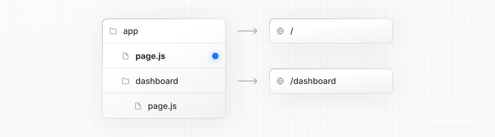
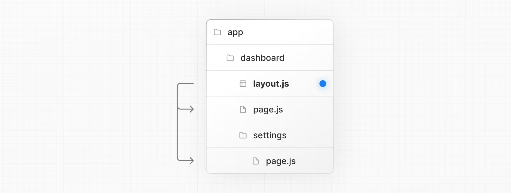
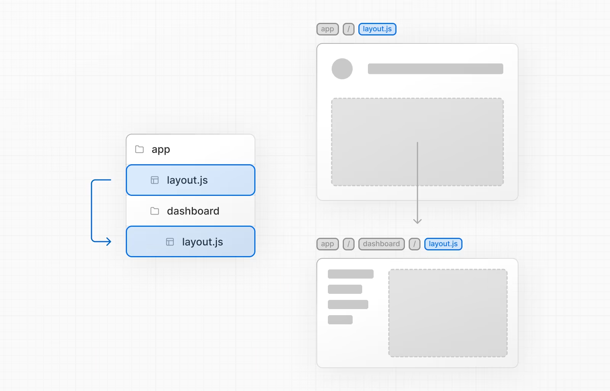
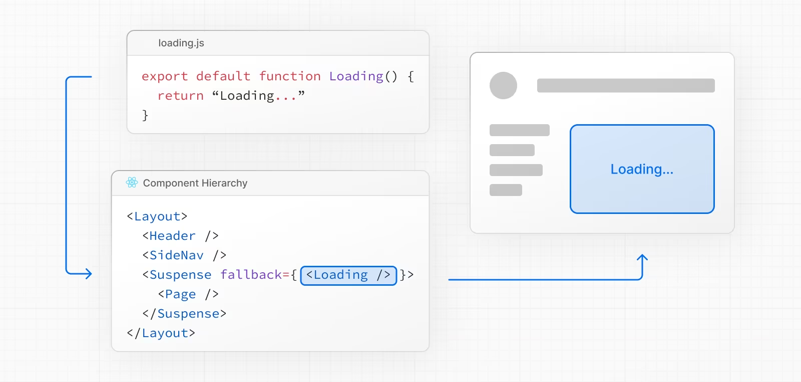
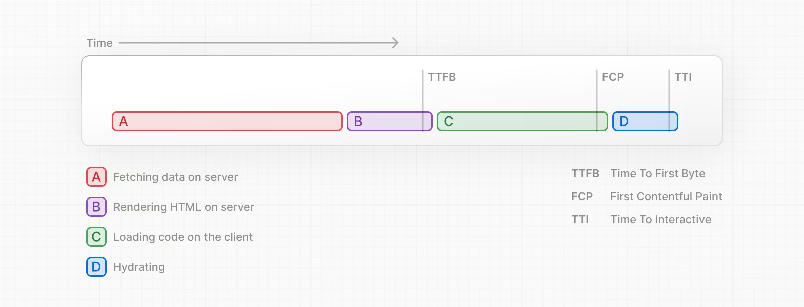

# Nextjs

## Routing

### Terminology

### App Router

### Roles of Folders and Files
- Folders : routes를 정함
- Files : UI를 생성함

### Route Segments

### Nested Routes
- 폴더 안에 폴더를 구성하여 nested route를 사용
- e.g. /dashboard/settings

### File Conventions
- 구체적인 행동을 하는 UI를 생성하는 파일

| 파일명          | 설명                                                       |
|-----------------|------------------------------------------------------------|
| `layout`        | 세그먼트와 자식들을 위한 공통 UI                             |
| `page`          | 라우트의 고유 UI, 공개 라우트 생성                           |
| `loading`       | 세그먼트와 자식들을 위한 로딩 UI                             |
| `not-found`     | 세그먼트와 자식들을 위한 Not Found UI                        |
| `error`         | 세그먼트와 자식들을 위한 에러 UI                             |
| `global-error`  | 글로벌 에러 UI                                               |
| `route`         | 서버 측 API 엔드포인트                                       |
| `template`      | 특수 재렌더링 레이아웃 UI                                    |
| `default`       | 병렬 라우트를 위한 기본 UI                                   |

### Component Hierarchy
- 계층구조로 렌더링

- 부모 세그먼트안에서 사용될 수 있음

### Colocation
- page.js OR route.js 파일만 내용을 반환함
