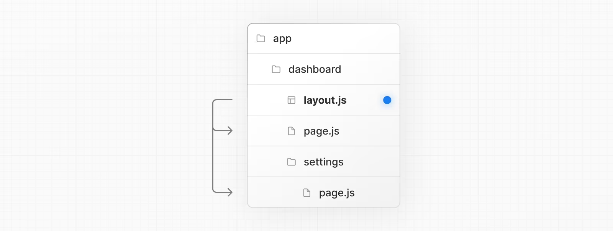

# Routing

## Pages and Layouts

- 페이지는 특정 라우트에 고유한 UI
- page.js 파일에서 컴포넌트를 export하여 페이지를 정의함

## Layouts

- 레이아웃은 여러 라우트 사이에서 공유되는 UI
- 네비게이션 시 상태를 유지하고 상호작용을 지속
- 재렌더링 되지 않음
- 레이아웃은 중첩될 수 있음

## Root Layout (Required)
- 필수로 존재해야함
- html과 body 태그가 있어야 함

## Nesting Layout

- child 레이아웃을 props로 받아서 nested layout을 구성할 수 있음

## Templates

- 템플릿은 레이아웃과 달리 페이지 이동시에 재렌더링됨
- 아래와 같은 상황에 적합함
    - useEffect나 useState에 의존하는 기능
    - To change the default framework behavior. For example, Suspense Boundaries inside layouts only show the fallback the first time the Layout is loaded and not when switching pages. For templates, the fallback is shown on each navigation.

## Metadata
- metadata를 사용하면 루트 레이아웃에 `<title>`이나 `<meta>` 태그를 수동으로 추가안해도 됨

``` tsx
import { Metadata } from 'next'
 
export const metadata: Metadata = {
  title: 'Next.js',
}
 
export default function Page() {
  return '...'
}
```

## Linking and Navigating
- nextjs에서의 4가지 라우트 방식
  - `<Link>` Component
  - useRouter hook (Client Components)
  - redirect function (Server Components)
  - History API

### `<Link>` Component
- `<a>` 태그를 상속
- preFetching과 클라이언트 사이드 네비게이션을 제공
- 
  ```jsx

  // 기본 예제
  import Link from 'next/link'

  export default function Page() {
    return <Link href="/dashboard">Dashboard</Link>
  }

  // dinamic segments를 링크
  import Link from 'next/link'
 
  export default function PostList({ posts }) {
    return (
      <ul>
        {posts.map((post) => (
          <li key={post.id}>
            <Link href={`/blog/${post.slug}`}>{post.title}</Link>
          </li>
        ))}
      </ul>
    )
  }

  // 현재 pathName에 따라 링크를 활성화/비활성화
  'use client'
 
  import { usePathname } from 'next/navigation'
  import Link from 'next/link'
  
  export function Links() {
    const pathname = usePathname()
  
    return (
      <nav>
        <ul>
          <li>
            <Link className={`link ${pathname === '/' ? 'active' : ''}`} href="/">
              Home
            </Link>
          </li>
          <li>
            <Link
              className={`link ${pathname === '/about' ? 'active' : ''}`}
              href="/about"
            >
              About
            </Link>
          </li>
        </ul>
      </nav>
    )
  }
  ```
- scrolling to and id
  - 새 경로로 이동할 때 특정 요소로 스크롤할 수 있음
  - ```jsx
    <Link href="/dashboard#settings">Settings</Link>

    // Output
    <a href="/dashboard#settings">Settings</a>

- Disabling scroll restoration
  - 새 경로로 이동할 때 스크롤의 위치 유지 여부
  - ```jsx
    // next/link
    <Link href="/dashboard" scroll={false}>
      Dashboard
    </Link>

    // useRouter
    import { useRouter } from 'next/navigation'

    const router = useRouter()

    router.push('/dashboard', { scroll: false })
    ```
### useRouter() hook
- 클라이언트 컴포넌트로부터 경로를 이동할 때 사용

### redirect function
- 서버사이드 컴포넌트에서는 redirect 함수를 사용하여 경로를 이동함
- ``` tsx
  redirect('/login')
  ```
### Using the native History API
- window.history.pushState
  - history stack에 새로운 항목을 추가
  - 이전 경로로 돌아갈 수 있음
- window.history.replaceState
  - 현재 히스토리 항목을 교체
  - 이전 경로로 돌아갈 수 없음

## Loading UI and Streaming
- loading.js를 통해 로딩 UI를 생성할 수 있음
- 세그먼트의 콘텐츠가 로딩되는 동안 즉시 로딩 상태를 표시
- 새로운 콘텐츠가 렌더링 완료되면 자동으로 교체됨

### instant Loading States
- ```jsx
  export default function Loading() {
    // You can add any UI inside Loading, including a Skeleton.
    return <LoadingSkeleton />
  }
  ```
  
  - suspense 요소를 loading UI로 대체

### Steaming with Suspense
- what is Streaming?
  - 
  - hydrating 과정은 컴포넌트의 모든 코드를 서버로부터 받아야 가능함
  - 스트리밍은 html을 작은 chunk로 나누고 점진적으로 전송하여 이를 개선
  - 
  - `<Suspense>`는 비동기 작업을 수행하는 컴포넌트를 감싸고, 작업이 진행되는 동안 대체 UI를 표시한 후 작업이 완료되면 컴포넌트를 교체함

## Error Handling
- error.js 파일에서 오류를 처리
- 오류를 해당 세그먼트에 격리하여 애플리케이션의 나머지 부분이 정상 작동하도록함
- 전체 페이지를 새로 고치지 않고 오류로부터 복구할 수 있음
- ```typescript
  'use client' // Error components must be Client Components

  import { useEffect } from 'react'

  export default function Error({
    error,
    reset,
  }: {
    error: Error & { digest?: string }
    reset: () => void
  }) {
    useEffect(() => {
      // Log the error to an error reporting service
      console.error(error)
    }, [error])

    return (
      <div>
        <h2>Something went wrong!</h2>
        <button
          onClick={
            // Attempt to recover by trying to re-render the segment
            () => reset()
          }
        >
          Try again
        </button>
      </div>
    )
  }
  ```
- 

## Redirecting
  - redirect
  - permanentRedirect
  - useRouter
  - redirects in next.config.js
  - NextResponse.redirect

### redirect function
  - 다른 URL로 redirect
  - server Components, Route Handlers, Server Actions에서 호출
  - ``` tsx
    redirect ('/post/${id})
    ```
### permanentRedirect function
  - 다른 URL로 영구적으로 이동..?
  - server Components, Route Handlers, Server Actions에서 호출

### useRouter() hook
  - 클라이언트 컴포넌트에서 redirect
  - ```typescript
    'use client'

    import { useRouter } from 'next/navigation'

    export default function Page() {
      const router = useRouter()

      return (
        <button type="button" onClick={() => router.push('/dashboard')}>
          Dashboard
        </button>
      )
    }
    ```
### redirects in next.config.js
- 들어오는 요청 경로를 다른 목적지 경로로 리디렉션
- 경로, 헤더, 쿠키, 쿼리 매칭을 지원하여 들어오는 요청에 따라 사용자를 유연하게 리디렉션
- ```javascript
  module.exports = {
    async redirects() {
      return [
        // Basic redirect
        {
          source: '/about',
          destination: '/',
          permanent: true,
        },
        // Wildcard path matching
        {
          source: '/blog/:slug',
          destination: '/news/:slug',
          permanent: true,
        },
      ]
    },
  }
  ```
### NextResponse.redirect in Middleware
- 요청이 완료되기 전에 코드를 실행할 수 있음

### Dynamic Routes
  - 동적 세그먼트는 경로를 동적 데이터로부터 생성할 때 사용
  - [id], [slug] 처럼 폴더이름을 대괄호로 감싸서 생성
  - ```typescript
    export default function Page({ params }: { params: { slug: string } }) {
      return <div>My Post: {params.slug}</div>
    }
    ```

### Generating Static Params
  - 정적인 데이터는 generatingStaticParams function을 사용
  - 레이아웃 및 페이지에서 한 번만 요청하도록 요청을 자동으로 메모이즈함
  - 모든 후속 세그먼트를 포착
    | Route                         | Example URL     | params              |
    |-------------------------------|-----------------|---------------------|
    | app/shop/[...slug]/page.js    | /shop/a         | { slug: ['a'] }     |
    | app/shop/[...slug]/page.js    | /shop/a/b       | { slug: ['a', 'b'] }|
    | app/shop/[...slug]/page.js    | /shop/a/b/c     | { slug: ['a', 'b', 'c'] } |
  - 옵셔널하게 포착
    | Route                          | Example URL      | params              |
    |--------------------------------|------------------|---------------------|
    | app/shop/[[...slug]]/page.js   | /shop            | {}                  |
    | app/shop/[[...slug]]/page.js   | /shop/a          | { slug: ['a'] }     |
    | app/shop/[[...slug]]/page.js   | /shop/a/b        | { slug: ['a', 'b'] }|
    | app/shop/[[...slug]]/page.js   | /shop/a/b/c      | { slug: ['a', 'b', 'c'] } |
