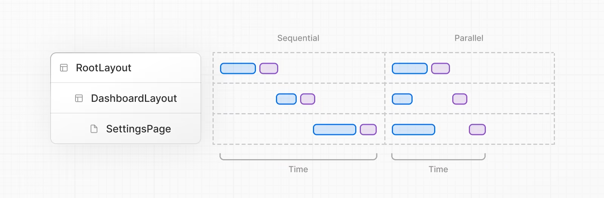

# Data Fetching

## Data Fetching, Caching, and Revalidating
- next.js는 fetch를 확장함
- 서버에서 각 fetch 요청의 캐싱 및 재검증 동작을 구성할 수 있다.
- react는 컴포넌트 트리를 렌더링할 때 fetch 요청을 자동으로 메모이즈함

### Cacheing Data
- ``` tsx
    // 'force-cache' is the default, and can be omitted
    fetch('https://...', { cache: 'force-cache' })
    ```

### Revalidating Data
- 캐시된 데이터는 두가지 방법으로 재검증 될 수 있음
    - 시간 기반 재검증 : 일정 시간이 지나면 재검증
        - ``` tsx
            fetch('https://...', { next: { revalidate: 3600 } })
            ```
    - 온디맨드 재검증 : 이벤트를 기반으로 데이터를 재검증
        - ``` tsx
            await fetch('/api/data', {
            next: { tags: ['collection'] }
            });

            // 재검증
            await revalidateTag('collection');
            ```
## Server Actions and Mutations
- server Actions은 서버에서 실행되는 비동기 함수이다.
- 서버 컴포넌트와 클라이언트 컴포넌트에서 사용 가능하다

### Convention
- 서버 액션은 "use server" 디렉티브와 함께 정의할 수 있다
- 파일의 제일 위 혹은 비동기 함수로 사용할 함수 위에 디렉티브를 사용

### Server Components
- 함수 및 모듈의 맨위에 "use server" 작성
``` tsx
// Server Component
export default function Page() {
  // Server Action
  async function create() {
    'use server'
 
    // ...
  }
 
  return (
    // ...
  )
}
```

### Client Components
- 클라이언트 컴포넌트에서는 모듈 수준의 서버 액션만 사용가능
```
// serverActions.js
"use server";

export function myServerAction() {
  // 서버 측 코드
}

export function anotherServerAction() {
  // 또 다른 서버 측 코드
}


// ClientComponent.js
import { myServerAction, anotherServerAction } from './serverActions';

function ClientComponent() {
  // 클라이언트 측 코드
  myServerAction();
  anotherServerAction();
}
```

### Behavior
- 서버 액션은 form 태그에서 action 속성으로 호출할 수 있다
- 서버 액션은 useEffect나 Button에서도 호출할 수 있다.

### example
```
export default function Page() {
  async function createInvoice(formData: FormData) {
    'use server'
 
    const rawFormData = {
      customerId: formData.get('customerId'),
      amount: formData.get('amount'),
      status: formData.get('status'),
    }
 
    // mutate data
    // revalidate cache
  }
 
  return <form action={createInvoice}>...</form>
}

// 서버 액션은 native formData 메서드를 사용할 수 있음
```

```
'use client'
 
import { useFormStatus } from 'react-dom'
 
export function SubmitButton() {
  const { pending } = useFormStatus()
 
  return (
    <button type="submit" disabled={pending}>
      Add
    </button>
  )
}

// useFormStatus hook을 사용하여 submit될 때 pending 상태를 알 수 있음
```

## Data Fetching Patterns and Best Practices

### Fetching data on the server
- 가능하면, 서버 컴포넌트와 함께 서버에서 데이터를 fetching하는 것을 추천함
    - 백엔드로부터 다이렉트로 데이터에 접근 가능
    - 보안에 좋음
    - 같은 환경에서 데이터를 받아서 렌더링할 수 있음 (커뮤니케이션 비용 절감)
    - 멀티 환경에 있는 데이터를 single round trip으로 가져올 수 있음

### Fetching data where it's needed
- 같은 데이터를 여러 컴포넌트에서 사용하고 싶을 때, 데이터를 글로벌하게 fetch하지 마라
- 각 컴포넌트에서 fetch 하되 캐시를 사용해라
- fetch가 메모이제이션을 하기 때문인듯

### Streaming
- 즉각적으로 부분적인 UI를 렌더링할 수 있음
- loading state를 보여줄 수 있다.

### Parallel and sequential data fetching
- 두 가지 데이터 페칭 방법

    - sequential data fetching : 하나가 끝나면 다른 하나를 fetch
    - parallel data fetching : client-server waterfall을 줄일 수 있음

### Sequential Data Fetching
``` tsx
// ...
 
async function Playlists({ artistID }: { artistID: string }) {
  // Wait for the playlists
  const playlists = await getArtistPlaylists(artistID)
 
  return (
    <ul>
      {playlists.map((playlist) => (
        <li key={playlist.id}>{playlist.name}</li>
      ))}
    </ul>
  )
}
 
export default async function Page({
  params: { username },
}: {
  params: { username: string }
}) {
  // Wait for the artist
  const artist = await getArtist(username)
 
  return (
    <>
      <h1>{artist.name}</h1>
      <Suspense fallback={<div>Loading...</div>}>
        <Playlists artistID={artist.id} />
      </Suspense>
    </>
  )
}

// 아티스트 fetch가 끝나면 playList를 fetch
```

### Parallel Data Fetching
```
import Albums from './albums'
 
async function getArtist(username: string) {
  const res = await fetch(`https://api.example.com/artist/${username}`)
  return res.json()
}
 
async function getArtistAlbums(username: string) {
  const res = await fetch(`https://api.example.com/artist/${username}/albums`)
  return res.json()
}
 
export default async function Page({
  params: { username },
}: {
  params: { username: string }
}) {
  // Initiate both requests in parallel
  const artistData = getArtist(username)
  const albumsData = getArtistAlbums(username)
 
  // Wait for the promises to resolve
  const [artist, albums] = await Promise.all([artistData, albumsData])
 
  return (
    <>
      <h1>{artist.name}</h1>
      <Albums list={albums}></Albums>
    </>
  )
}

// 사용할 컴포넌트 밖에서 fetch 함수를 정의하고 컴포넌트 안에서 호출해라
```

### Preloading Data
``` tsx
import { getItem } from '@/utils/get-item'

export const preload = (id: string) => {
  // void는 주어진 표현식을 평가하고 undefined를 반환합니다.
  // https://developer.mozilla.org/docs/Web/JavaScript/Reference/Operators/void
  void getItem(id)
}

export default async function Item({ id }: { id: string }) {
  const result = await getItem(id)
  // ...
}

// preloading 호출
import Item, { preload, checkIsAvailable } from '@/components/Item'

export default async function Page({
  params: { id },
}: {
  params: { id: string }
}) {
  // 아이템 데이터 로딩 시작
  preload(id)
  // 다른 비동기 작업 수행
  const isAvailable = await checkIsAvailable()

  return isAvailable ? <Item id={id} /> : null
}

// 데이터 페칭을 병렬로 수행하여 초기 로딩 시간을 줄일 수 있습니다. preload 함수는 필요한 데이터를 미리 로드하며, 이는 컴포넌트 렌더링 전에 비동기 작업을 수행하는 데 유용합니다.
```