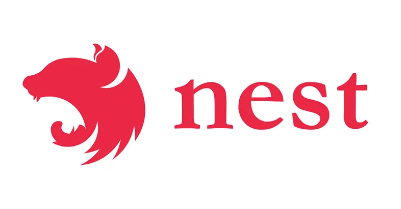

# NestJS 사용 후기 정리

원본: [링크](https://medium.com/naverfinancial/nestjs-%EC%82%AC%EC%9A%A9-%EC%86%8C%EA%B0%90-f851527f7922)  
작성자: 네이버파이낸셜 BE 개발자 주도현

## JavaScript 생태계의 발전
- 2009년 Node.js 발표 이후 JavaScript가 브라우저를 넘어 Server-Side 환경에서도 활발히 사용됨.
- 높은 생산성으로 일반적인 백엔드 API 기능 제공에 강점.

## Koa + Typescript 사용 경험
- Koa는 작은 기능 서버를 빠르게 개발하는데 강점이 있으나, 기능이 늘어나면 코드 스타일과 구조의 파편화 문제 발생.
- 단순한 구조와 기능은 빠르게 적응할 수 있으나, 더 많은 기능을 제공하는 프레임워크에 대한 필요성 대두.

## NestJS 전환
- NestJS는 Java 스프링 프레임워크와 유사한 구조로 DI를 통해 의존성을 주입받아 사용.
- 러닝커브가 예상보다 크지 않았으나, Express나 Fastify, rxjs, class-validator, jest 등 관련 지식 필요.
- Koa에서 NestJS로 전환하며, 자동화된 테스트 스위트 덕분에 사이드 이펙트 없이 전환 완료.

## NestJS의 장점
- 기능과 구조를 세분화해 코드의 유지보수성과 관리 용이성 향상.
- DI를 통한 의존성 주입으로 테스트 시 Mock 주입이 수월.
- CLI 기능을 통한 컴포넌트 생성, 모듈 등록, 테스트 스켈레톤 코드 생성 등의 자동화 지원.
- Swagger 도입이 쉬워 API 명세 관리에 유리.

## Express와 Fastify 비교
- 기반 서버 플랫폼을 Express와 Fastify 중 선택 가능
- Fastify 사용 시 설정의 일관성 부족과 문서의 불편함 존재.
- 예외 발생 시 ExceptionFilter에서 에러 페이지 렌더링 문제가 Fastify에서 발생.
- REST API 구현에는 문제가 없으나, 특수 기능 필요 시 Express 추천.

## 기타
- 전환 작업 시 @nestjs/core 8.x.x 버전 사용.
- 테스트 프레임워크로 Mocha + Chai 조합 사용, Jest와 Mocha의 테스트 코드 문법이 비슷해 전환 용이.
- 커스텀 로거 사용 가능.

## 결론
- NestJS는 완벽하지 않으나, Node.js 플랫폼에서 규모 있는 백엔드 어플리케이션 개발에 좋은 선택지이며 앞으로의 발전이 기대됨

## 번외)
### Express와 NestJS의 장단점 비교

| **항목**       | **Express**                                                                                                                                 | **NestJS**                                                                                                                            |
|----------------|----------------------------------------------------------------------------------------------------------------------------------------------|---------------------------------------------------------------------------------------------------------------------------------------|
| **장점**       | - 경량화된 미들웨어 기반 아키텍처로 빠르고 유연함                                                                                              | - 모듈화된 구조로 대규모 애플리케이션 개발에 적합                                                                                       |
|                | - 간단하고 직관적인 API로 빠르게 학습 가능                                                                                                     | - Java 스프링 프레임워크와 유사한 구조로 체계적이고 일관된 개발 환경 제공                                                                 |
|                | - 넓고 활발한 커뮤니티와 풍부한 서드파티 라이브러리 제공                                                                                        | - 내장된 DI 컨테이너로 의존성 관리 용이                                                                                                 |
|                | - 다양한 서드파티 미들웨어와 쉽게 통합 가능                                                                                                    | - 강력한 CLI 도구 제공으로 컴포넌트 생성, 모듈 등록, 테스트 코드 생성 등 자동화 지원                                                      |
|                | - 빠르고 가벼운 성능                                                                                                                         | - 내장된 테스트 모듈 제공, Jest와 SuperTest 통합                                                                                         |
|                | - 자유로운 프로젝트 구조 설계 가능                                                                                                            | - 내장된 Swagger 통합으로 간편한 API 문서화 가능                                                                                        |
|                |                                                                                                                                              | - 가드, 인터셉터, 파이프 등 다양한 기능 제공                                                                                            |
| **단점**       | - 프로젝트 구조에 대한 강제성이 없어 대규모 애플리케이션 개발 시 구조적 복잡성 증가 가능                                                           | - 학습 곡선이 다소 높음                                                                                                                |
|                | - 기본적으로 DI(의존성 주입) 제공하지 않음, 서드파티 라이브러리 필요                                                                               | - 구조적 설계로 인해 소규모 프로젝트나 간단한 API 서버에는 다소 과할 수 있음                                                               |
|                | - 내장된 테스트 모듈이나 CLI 도구가 없음                                                                                                       | - Fastify와의 통합 시 일부 설정의 일관성 부족 및 문서의 불편함 존재                                                                      |
|                | - API 문서화를 위한 별도의 서드파티 도구 필요                                                                                                 | - 기본 구조에 따라 코드가 많아질 수 있음                                                                                                |
|                | - 개발자가 미들웨어와 라우팅을 직접 관리해야 함                                                                                                 | - 특정한 기능을 사용하지 않을 경우에도 모든 기능을 포함한 무거운 구조를 가질 수 있음                                                     |
|                |                                                                                                                                              | - 특정 기능에 대해 Express보다 문서나 예제가 부족할 수 있음                                                                              |
