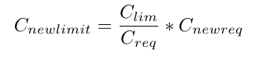

# Kubernetes Threshold-Based Auto-scaling Policies
[출처](https://www.researchgate.net/publication/357953795_Machine_Learning_Based_Adaptive_Auto-scaling_Policy_for_Resource_Orchestration_in_Kubernetes_Clusters)

- Kubernetes의 가장 중요한 특징 중 하나는 변화하는 조건에 반응하여 containerized workloads를 scale할 수 있는 능력임.
- 이는 auto-scaling으로 불리며, Kubernetes 클러스터에는 세 가지 인기 있는 auto-scaling 기법이 있다.
    - Horizontal Pod Autoscaler (HPA)
    - Cluster Autoscaler
    - Vertical pod Autoscaler (VPA)

## Horizontal Pod Autoscaler (HPA)

- **설명**: HPA는 pod replicas의 수를 조절함.  (horizontal scaling)
- **작동 방식**:
    - HPA controller는 workload의 pods의 metrics-server에서 utilization 정보를 수집
    - 이를 바탕으로 실행 중인 pod의 복사본 수를 변경할지 여부를 결정
    - 대부분의 경우, 특정 수의 pod replicas를 추가/삭제하면 현재 resource request 값이, 목표 값에 더 가까워지는지 여부를 판단하여 수행
- **예시**:
현재 n개의 pod가 실행 중이고 각 pod의 CPU utilization이 U1, U2, ..., Un이라면 평균 CPU utilization(Uavg)은 개별 utilization의 산술 평균

target CPU utilization(Utarget)이 주어지면, HPA controller는 Utarget과 Uavg가 최대한 가깝도록 pod replicas 수(n)를 조정하게 됨

예를 들어, target CPU utilization이 60%이고 현재 평균 CPU utilization이 90%인 경우, 현재 4개의 pod가 실행 중이라고 가정하면, 목표 utilization에 도달하기 위해 추가해야 할 pod 수(n')를 계산 가능
  

  
따라서 목표 utilization에 도달하기 위해 2개의 pod를 추가

## Cluster Autoscaler

- **설명**: Cluster Autoscaler는 클러스터의 worker nodes 수를 조절. Horizontal Pod Autoscaler (HPA)와 비슷하지만, 클러스터에서 pod replicas 수를 조절하는 대신 worker nodes 수를 변경한다는 차이가 있음
- **작동 방식**:
    - Cluster Autoscaler는 메모리나 CPU 자원이 부족하거나, Node Affinity 규칙이 적용되어 현재 사용 가능한 노드에서 스케줄링할 수 없는 pod가 있는지 클러스터를 확인함.
    - Cluster Autoscaler가 스케줄링할 수 없는 pod를 발견하면 관리 node pools을 검사하는데, 몇 개의 노드를 추가해야 이 pod를 스케줄링할 수 있는지 확인하고 가능하다면 필요한 수의 노드를 풀에 추가함

## Vertical Pod Autoscaler (VPA)

- **설명**: VPA는 container의 resources가 과하지도 부족하지도 않게 보장. 최적의 CPU 및 메모리 requests/limits 설정을 제안하며, 자동 업데이트 모드도 지원함
- **작동 방식**:
    - Recommender는 metrics server의 metrics를 사용하여 pod resource utilization을 모니터링하고 최적의 target 값을 추천
    - Updater는 새로운 예측 값으로 업데이트해야 하는 pod를 종료
    - Admission Controller는 추천 값을 새로 생성된 pod에 할당
- **예시**:

pod가 CPU request(Creq)와 CPU limit(Clim)를 가지고 있고, 추천된 CPU request 값이 Cnewreq라면, 추천된 CPU limit(Cnewlimit)은 다음과 같이 비례적으로 계산됨

  
예를 들어, Creq = 50M, Clim = 200M인 pod p가 있을 때, 추천된 request 값이 Cnewreq = 120M라면 다음과 같음.
  

- VPA의 주요 제한 사항
    - VPA는 현재 실행 중인 파드의 리소스(예: CPU, 메모리)를 실시간으로 조정할 수 없고, 기존 파드에 새로운 리소스 제한을 추가할 수 없음
    - 만약 파드가 예상된 리소스 사용 범위를 벗어나면, VPA는 그 파드를 종료해야 하며, 종료된 파드는 다시 시작할 때 VPA의 추천 리소스 설정으로 시작함

# 참고

## 레디스 클러스터 스케일아웃

https://tech.kakao.com/posts/491
https://tech.kakaopay.com/post/kakaopaysec-redis-on-kubernetes/

## 워크로드 오토스케일링 하기
https://kubernetes.io/docs/concepts/workloads/autoscaling/

## Kubernetes 주요 개념 요약

### Cluster 및 Node
- **Cluster**: 하나 이상의 노드로 구성된 Kubernetes 시스템의 기본 단위.
- **Node**: 애플리케이션 워크로드가 실행되는 단위. 물리적 또는 가상 머신.
  - **Master Node**: 클러스터 제어 평면, API 서버, 스케줄러, 컨트롤러 매니저 등이 실행됨.
  - **Worker Node**: 실제 애플리케이션이 실행되는 노드, 컨테이너 런타임, kubelet, kube-proxy 등이 포함됨.

### Workload
- **Pod**: Kubernetes에서 배포되는 최소 단위. 하나 이상의 컨테이너 포함.
- **Deployment**: 애플리케이션 배포 및 업데이트 관리. 파드 수 유지.
- **StatefulSet**: 상태 정보를 가지는 애플리케이션 관리.
- **DaemonSet**: 클러스터의 각 노드에서 파드의 복사본 실행.
- **Job**: 특정 작업을 수행한 후 완료되는 일회성 파드 실행.
- **CronJob**: 일정에 따라 주기적으로 작업 수행.

### Service 및 Network
- **Service**: 파드 집합에 대한 네트워크 접근 제공. 로드 밸런싱.
- **Ingress**: 클러스터 외부에서 내부 서비스로의 HTTP 및 HTTPS 경로 관리.

### Storage
- **Volume**: 컨테이너 간 데이터 공유 및 지속성 제공.
- **PersistentVolume (PV)**: 클러스터 내에서 관리되는 스토리지 리소스.
- **PersistentVolumeClaim (PVC)**: 사용자가 스토리지 리소스를 요청하는 방법.

### Config 및 Secret 관리
- **ConfigMap**: 설정 데이터를 저장하고 관리.
- **Secret**: 비밀번호, OAuth 토큰 및 SSH 키와 같은 민감한 정보 저장 및 관리.

### Namespace
- **Namespace**: 동일한 물리 클러스터 내에서 여러 가상 클러스터를 만드는 논리적 분리 단위.
- **Node Group**: 클라우드 환경에서 노드를 그룹화하여 관리하는 방법
    - Managed Node Groups: AWS EKS(Elastic Kubernetes Service)와 같은 클라우드 제공 업체에서 제공하는 기능으로, 노드 그룹을 자동으로 관리하고 업데이트
    - Instance Groups: GKE(Google Kubernetes Engine)에서 사용되는 개념으로, 유사한 구성의 노드를 그룹화하여 관리
    - Node Pools: GKE, AKS(Azure Kubernetes Service)와 같은 클라우드 환경에서 특정 유형의 노드를 그룹화하여 관리

### Autoscaling
- **Horizontal Pod Autoscaler (HPA)**: 파드 수를 자동으로 조정.
- **Vertical Pod Autoscaler (VPA)**: 파드에 할당된 리소스를 자동으로 조정.
- **Cluster Autoscaler**: 클러스터의 노드 수를 자동으로 조정.

### Scheduling 및 Placement Policies
- **Affinity**
  - **Node Affinity**: 특정 노드에 파드를 배치하는 선호도나 요구사항 설정.
  - **Pod Affinity**: 특정 파드가 있는 노드에 파드를 배치하는 규칙.
  - **Pod Anti-Affinity**: 특정 파드가 없는 노드에 파드를 배치하는 규칙.
- **Taints**: 노드에 특정 속성을 부여하여 파드 배치를 제한.
- **Tolerations**: 파드가 특정 테인트를 무시하고 해당 노드에 배치될 수 있도록 허용.
- **Node Selectors**: 파드를 특정 라벨을 가진 노드에만 배치.
- **Topology Spread Constraints**: 파드가 클러스터 내의 노드 또는 영역에 균등하게 분산되도록 함.
- **Resource Requests and Limits**: 파드가 필요로 하는 리소스를 지정하여, 해당 리소스를 제공할 수 있는 노드에만 배치.
- **Priority Classes**: 파드의 우선 순위를 설정하여 자원이 부족할 때 어떤 파드가 먼저 스케줄링되거나 축출될지 결정.
- **Node Name**: 파드를 특정 노드에 직접 배치할 수 있도록 노드 이름 지정.

## 참고하세요
https://velog.io/@airoasis/Kubernetes-Autoscaling
